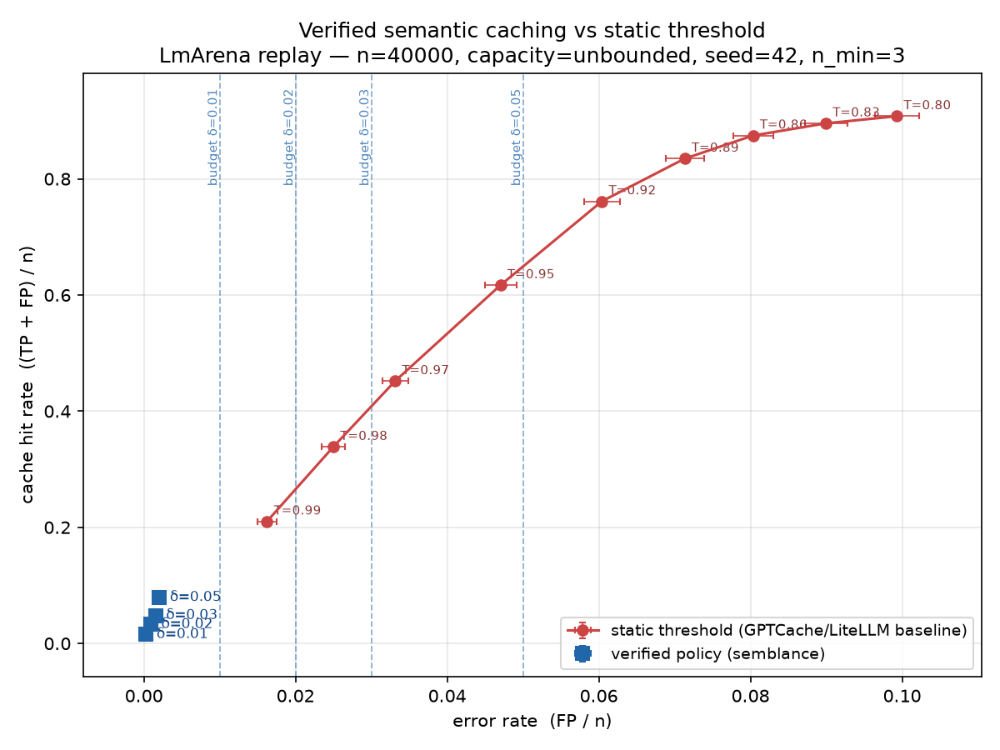
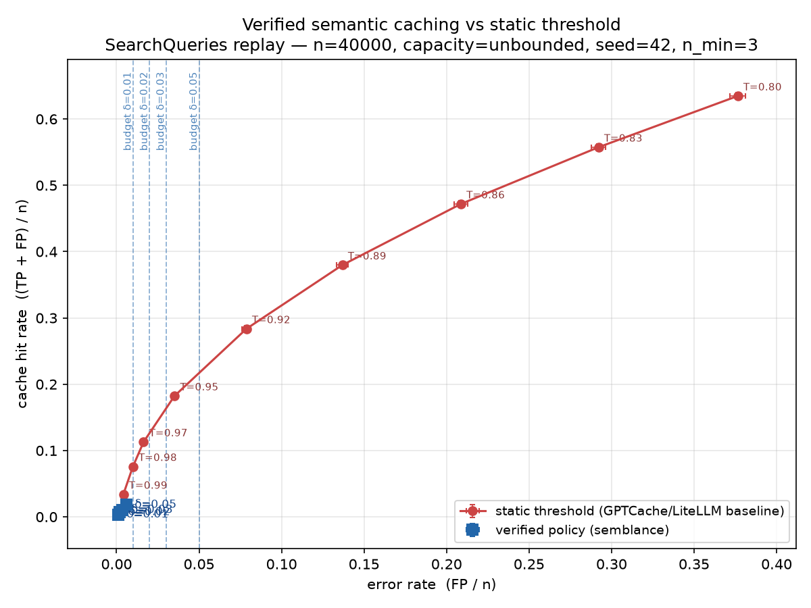
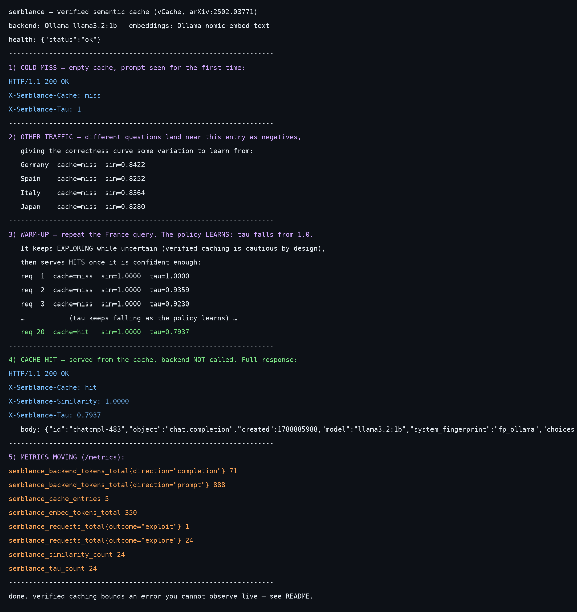
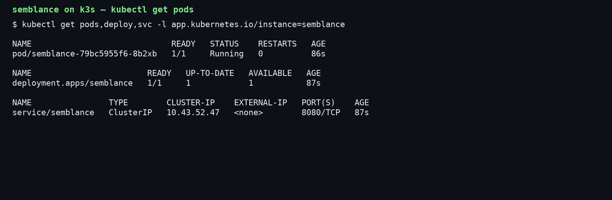
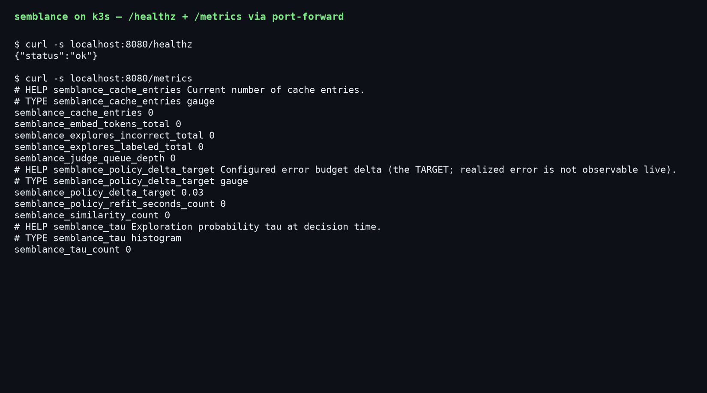

# semblance

**A verified semantic-caching LLM gateway.** OpenAI-compatible, written in Go,
deployed on Kubernetes. It implements the **vCache** algorithm — Schroeder et
al., *vCache: Verified Semantic Prompt Caching*, ICLR 2026,
[arXiv:2502.03771](https://arxiv.org/abs/2502.03771) (UC Berkeley Sky Computing
Lab) — which lets you cache LLM responses semantically while **bounding the
error rate by a budget `δ` you choose**, instead of guessing a similarity
threshold and hoping.

> **What's the honest claim?** Semantic caching is commodity (LiteLLM, Portkey,
> GPTCache). Verified thresholds are the *paper's* contribution. semblance's
> contribution is a **production Go gateway on Kubernetes** that implements the
> algorithm and resolves the systems problems the paper leaves open —
> concurrency, eviction, cold start, refit cost. The cited paper is the source
> of the idea; this repo is the system.

---

## The result (measured, reproducible)

Offline replay of the paper's public Apache-2.0 benchmarks, feeding the datasets'
precomputed embeddings through the real cache + policy. Two arms: **static
threshold** (the GPTCache/LiteLLM baseline) vs the **verified policy** at four
error budgets. N=40,000 per run, seed 42, no eviction.

**The guarantee held in every single run** — across both datasets and all four δ
(8 verified runs), the realized error rate `FP/n` came in **at or under its δ**.

| | LmArena (dense paraphrases) | SearchQueries (sparse) |
|---|---|---|
| **Verified**, δ=0.05 | hit **7.9%** at **0.20%** error | hit 1.8% at 0.59% error |
| **Static**, lowest error reachable | 1.62% error (T=0.99) | 0.41% error (T=0.99) |
| **Static**, aggressive threshold | — | **37.6% error** (T=0.80) |

Two honest readings:

- **LmArena (headline):** the verified cache serves in a **sub-1% error regime
  that no static threshold can reach** — static's error *floor* is 1.62%. If you
  need a guarantee below that, static gives you nothing; verified gives you a
  tunable knob.
- **SearchQueries (counterweight):** a sparse-repeat workload where an *untuned*
  static threshold is catastrophic (**37.6% error**), while verified stays safely
  under budget. That's the argument *for* a guarantee — you don't have to find
  the right threshold per workload.

<p align="center">
  
  
</p>

**The honest limitation:** the verified arm is *conservative* — at δ=0.05 on
LmArena it runs ~24× under its own budget (0.2% vs 5%), leaving hit rate on the
table. Choosing `n_min=3` (the cold-start floor) over the default 5 roughly
doubled the hit rate while still respecting every δ; the sensitivity study is in
[DECISIONS.md](DECISIONS.md). Squeezing more of the budget safely is the main
open direction.

Regenerate: `go run ./bench --input <jsonl> --limit 40000 --seed 42 --nmin 3`.

---

## How it works

```
client (OpenAI SDK)                     semblance gateway
      │  POST /v1/chat/completions            │
      ▼                                        ▼
  ┌───────────────┐   bypass?  ────────────▶ passthrough to backend (stream, tools, n>1, temp>ceiling)
  │  middleware   │
  │ recover · id  │   embed final user turn ─▶ nearest neighbor in an EXACT-MATCH bucket
  │ log · auth ·  │            (bucket = sha256(model│system│temp│top_p│prior turns))
  │ budget        │                             │  similarity s
  └───────────────┘                             ▼
                                        policy.Decide(observations, s)
                                        · fit a logistic P(correct│s)=σ(γ(s−t))
                                        · pessimistic band on the threshold t
                                        · exploration probability τ; draw u
                                        ├── EXPLOIT (u>τ): serve cached answer
                                        └── EXPLORE (u≤τ): call backend, return it,
                                              then async-label c (id_set / judge)
                                              and guarded-insert (Algorithm 1)
```

The statistics live in [`internal/policy`](internal/policy) — an L2-regularized
logistic fit and a delta-method confidence band, written from the paper's
equations (no ML library), with a plain-language walkthrough in
[`internal/policy/NOTES.md`](internal/policy/NOTES.md). Response headers expose
every decision: `X-Semblance-Cache: hit|miss|bypass`, `X-Semblance-Similarity`,
`X-Semblance-Tau`.

---

## Quickstart

```bash
go test ./...                 # everything is unit-tested; go test -race ./... is clean

# Run it locally against Ollama (backend + embeddings, no cloud key needed):
ollama pull llama3.2:1b && ollama pull nomic-embed-text
OPENAI_API_KEY=ollama \
  SEMBLANCE_EMBED_URL=http://localhost:11434/v1 SEMBLANCE_EMBED_MODEL=nomic-embed-text \
  SEMBLANCE_EMBED_DIMENSIONS=768 SEMBLANCE_BACKEND_URL=http://localhost:11434/v1 \
  go run ./cmd/semblance      # listens on :8080

# It's a drop-in OpenAI endpoint — prove it with the official SDK:
python demo/openai_sdk_check.py        # PASS: unmodified openai client gets "Paris."
```

**Live demo** (`demo/run_demo.sh`, recording in
[`demo/semblance-demo.cast`](demo/semblance-demo.cast)): a cold miss, then the
policy learning (τ falling from 1.0), then a paraphrase served as a **cache hit**
with the headers set, then the metrics moving.



---

## Metrics & cost

`/metrics` (unauthenticated, like `/healthz`) exposes Prometheus collectors:
request outcomes, τ / similarity / refit histograms, backend+embedding tokens,
and USD cost split into `spent` (explores), `embedding`, and `saved` (the modeled
cost of the backend call a hit avoided). Costs are read from real `usage` fields,
never estimated. Per-key spend budgets return HTTP 429 when exceeded.

**On purpose, there is no live `error_rate_realized` metric.** You cannot compute
true `FP/n` in production — an exploit serves the cache and never calls the model,
so you never learn whether it was wrong. Realized error is a benchmark-only
quantity. What's exposed instead is the δ *target* plus honest proxies
(judge-observed c=0 rate, hit rate). *The missing metric is the whole point of the
guarantee: it bounds an error you cannot otherwise observe live.*

---

## Deploy (local k3s)

Multi-stage Dockerfile → static `CGO_ENABLED=0` binary in `distroless/static`
(~5 MiB). A Helm chart in [`deploy/helm/semblance`](deploy/helm/semblance)
installs it with `imagePullPolicy: Never` (k3s uses the image imported into
containerd — see [deploy/README.md](deploy/README.md)).

<p align="center">
  
  
</p>

---

## The systems gaps the paper leaves open (and how semblance closes them)

| Gap | Resolution |
|---|---|
| **Concurrency** | Sharded lock-striped store; `Nearest` returns copied snapshots. `go test -race` clean. |
| **Bounded memory** | Per-shard LRU eviction with a capacity bound. |
| **Cold start** | Force-explore below `n_min` observations + L2-regularized fit — both strictly more conservative, so they cannot weaken the guarantee. |
| **Refit cost** | The logistic fit is 2 parameters (Newton/IRLS, a few iterations); observations are reservoir-capped, so re-fitting per request is cheap. |
| **Correctness scoping** | Semantic matching only within an exact-match bucket (model + system + params + prior turns). |
| **Non-cacheable requests** | Bypass (with a metric) for streaming, tools/functions, `n>1`, or high temperature. |
| **Async labeling** | Equivalence judging runs off the critical path behind a bounded queue. |

Full rationale, the Eq-5-vs-Algorithm-1 choice, the band interpretation, the
marginal-vs-conditional guarantee, and the licensing position are in
[DECISIONS.md](DECISIONS.md).

---

## Non-goals / future work

Named explicitly so the scope is honest, not accidental:

- **Squeeze the δ budget** — the verified arm is currently conservative.
- **Streaming *through* the cache** (today streaming bypasses).
- **An ANN index** (HNSW) — today it's a linear scan; that's the scaling path.
- **Multi-backend routing**, a persistent store (Redis; the `Store` is an
  interface), a self-hosted embedding sidecar, fine-tuned embeddings.
- **Eval-gated routing** is a *separate* project (gatecheck), deliberately kept
  apart.

---

## Layout

```
cmd/semblance        process entrypoint (config, slog, graceful shutdown)
internal/gateway     HTTP surface: routing, middleware, the cache decision path
internal/policy      the verified-caching statistics (the load-bearing package)
internal/cache       sharded store, cosine match, guarded insert, LRU + reservoir
internal/embed       Embedder interface, OpenAI impl, deterministic fake
internal/judge       async equivalence labeling
internal/metrics     Prometheus collectors + /metrics
internal/pricing     price table + cost accounting;  internal/budget  per-key budgets
bench/               offline replay harness (the results above)
tools/prep/          one-time dataset extraction (Python);  tools/plot_results.py
deploy/              Dockerfile-built image + Helm chart for k3s
demo/                OpenAI-SDK proof + recorded live demo
```

## License / attribution

The vCache **paper** is CC BY-NC-ND; semblance is a **clean-room** implementation
from its equations (no vCache source consulted or vendored). The **datasets** are
Apache-2.0. Cite the paper: Schroeder et al., *vCache: Verified Semantic Prompt
Caching*, ICLR 2026, arXiv:2502.03771.
